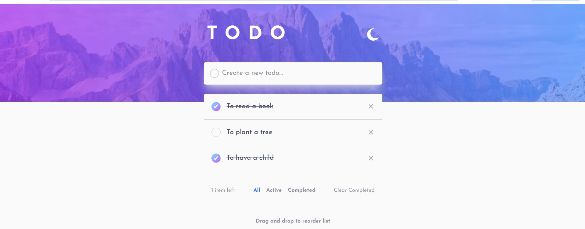
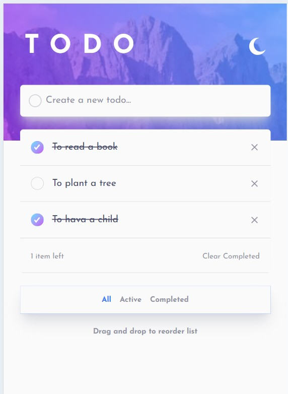
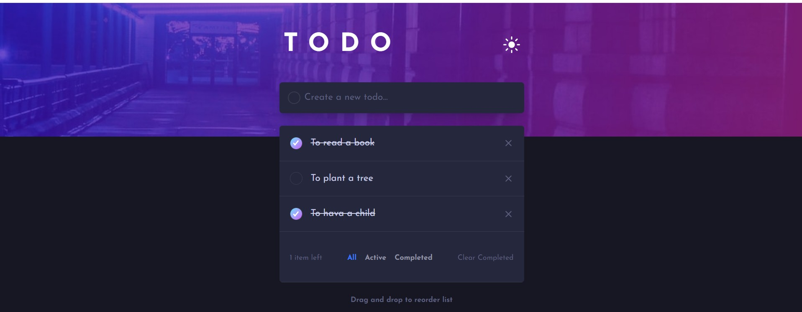
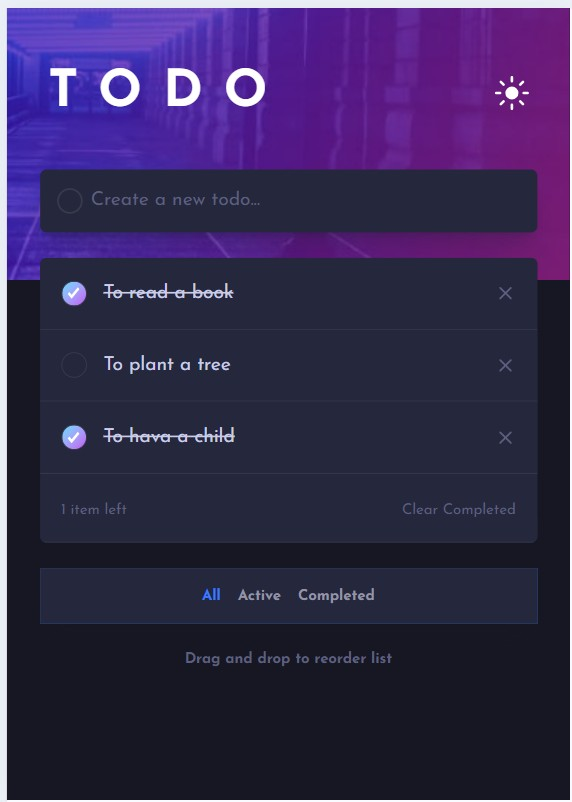

# Frontend Mentor - Todo app solution

This is a solution to the [Todo app challenge on Frontend Mentor](https://www.frontendmentor.io/challenges/todo-app-Su1_KokOW). Frontend Mentor challenges help you improve your coding skills by building realistic projects. 

## Table of contents

- [Overview](#overview)
  - [The challenge](#the-challenge)
  - [Screenshot](#screenshot)
  - [Links](#links)
- [My process](#my-process)
  - [Built with](#built-with)
  - [What I learned](#what-i-learned)
  - [Useful resources](#useful-resources)
  - [AI Collaboration](#ai-collaboration)
- [Author](#author)

## Overview

### The challenge

Users should be able to:

- View the optimal layout for the app depending on their device's screen size
- See hover states for all interactive elements on the page
- Add new todos to the list
- Mark todos as complete
- Delete todos from the list
- Filter by all/active/complete todos
- Clear all completed todos
- Toggle light and dark mode
- **Bonus**: Drag and drop to reorder items on the list

### Screenshot

### Links

- Solution URL: [@github](https://github.com/DanielMarques1404/todo-app)
- Live Site URL: [@todo-app](https://todo-app-frontendmentor-daniel.vercel.app/)

## My process

### Built with

- Semantic HTML5 markup
- CSS custom properties
- [TailwindCSS](https://tailwindcss.com/) - A utility-first CSS framework
- Mobile-first workflow
- [React](https://react.dev/) - JS library
- [Vite](https://vite.dev/) - React framework
- [dnd-kit/react](https://dndkit.com/) - dnd kit
- [opencode](https://opencode.ai) - opencode AI assistent

### What I learned

I learned how to use dnd-kit. A very powerfull tool in the matter of drag and drop problems. Very useful e easy aproach.

### Useful resources

- [dnd-kit](https://dndkit.com/) - This helped me in the drag and drop issues.

### AI Collaboration

Github Copilot and Opencode (GPT-5.5)  were my partners during this project. In my previous experiences AI assistance was mostly in css issues. This time, I've used more of its power to take more code from the architecture I've planned.

## Author

- Frontend Mentor - [@DanielMarques1404](https://www.frontendmentor.io/profile/DanielMarques1404)
- LinkedIn - [@dan-marques](https://www.linkedin.com/in/dan-marques/)